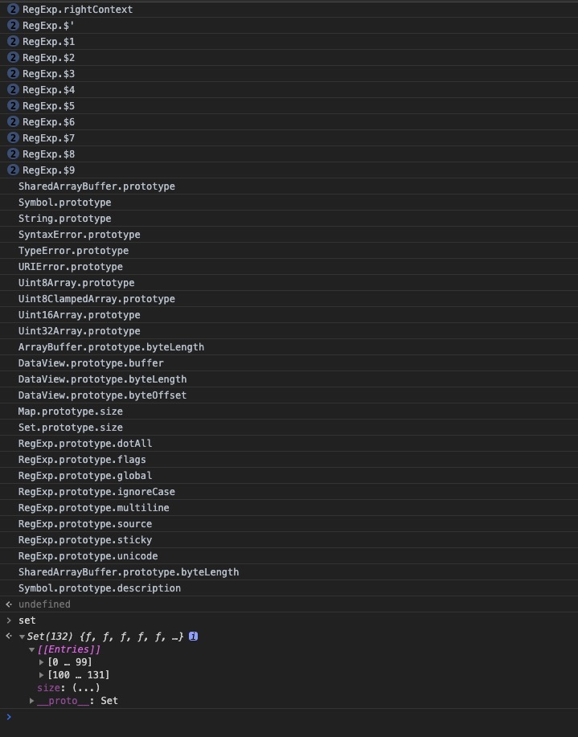
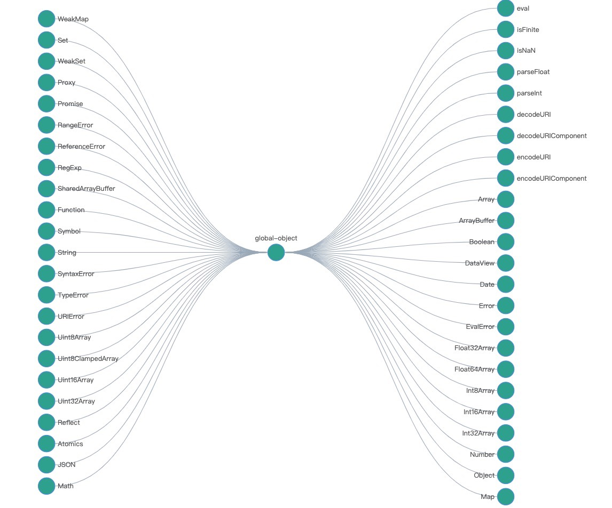

# Execution context 要有一个大体的框架
- realm：
- 宏任务：
- 微任务：
- 函数调用：
- 语句/声明：
- 表达式：
- 直接量/变量/this：
--------------------------------------------------------------------------------------
# js对象分类：
- 宿主对象 host Objects 由宿主环境决定
  - 固有的 new Image()
  - 用户可创建的 document.creatElement()就可以创建对象
- 内置对象 Built-in Objects 由js语言决定
  - 固有对象 由标准决定，在运行时阶段创建的
  获取全部 JavaScript 固有对象:
  ```
    // 参考 https://www.ecma-international.org/ecma-262/10.0/index.html#sec-value-properties-of-the-global-object
    var globalProperties = [
      // Value Properties of the Global Object
      // "Infinity",
      // "undefined",
      "NaN",
      // Function Properties of the Global Object
      "eval",
      "isFinite",
      "isNaN",
      "parseFloat",
      "parseInt",
      "decodeURI",
      "decodeURIComponent",
      "encodeURI",
      "encodeURIComponent",
      // Constructor Properties of the Global Object
      "Array",
      "ArrayBuffer",
      "Boolean",
      "DataView",
      "Date",
      "Error",
      "EvalError",
      "Float32Array",
      "Float64Array",
      "Int8Array",
      "Int16Array",
      "Int32Array",
      "Number",
      "Object",
      "Map",
      "WeakMap",
      "Set",
      "WeakSet",
      "Proxy",
      "Promise",
      "RangeError",
      "ReferenceError",
      "RegExp",
      "SharedArrayBuffer",
      "Function",
      "Symbol",
      "String",
      "SyntaxError",
      "TypeError",
      "URIError",
      "Uint8Array",
      "Uint8ClampedArray",
      "Uint16Array",
      "Uint32Array",
      // Other Properties of the Global Object
      "Reflect",
      "Atomics",
      "JSON",
      "Math",
    ];
    var set = new Set();
    var queue = [];
    for (var p of globalProperties) {
      queue.push({
        path: [p],
        object: this[p],
      });
    }
    let current;
    while (queue.length) {
      current = queue.shift();
      console.log(current.path.join("."));
      if (set.has(current.object)) {
        continue;
      }
      set.add(current.object);
      for (let p of Object.getOwnPropertyNames(current.object)) {
        var property = Object.getOwnPropertyDescriptor(current.object, p);
        if (
          property.hasOwnProperty("value") &&
          ((property.value != null && typeof property.value === "object") ||
            typeof property.value === "object") &&
          property.value instanceof Object
        ) {
          queue.push({
            path: current.path.concat([p]),
            object: property.value,
          });
        }
        if (property.hasOwnProperty("get") && typeof property.get === "function") {
          queue.push({
            path: current.path.concat([p]),
            object: property.get,
          });
        }
        if (property.hasOwnProperty("set") && typeof property.set === "function") {
          queue.push({
            path: current.path.concat([p]),
            object: property.set,
          });
        }
      }
    }
  ```
result：

用g6表示：

  - 原生对象
      |基本类型      |基础功能和数据结构       |错误类型        |二进制操作         |带类型的数组           |
      |-------------|----------------------|--------------|-----------------|-------------------- |
      |String       |Array                 |Error         |ArrayBuffer      |Float32Array         |
      |Object       |Date                  |TypeError     |DataView         |Float64Array         |
      |Number       |Promise               |ReferenceError|SharedArrayBuffer|Int8Array            |
      |Boolean      |Proxy                 |SyntaxError   |                 |Int16Array           |
      |Symbol       |Map                   |RangeError    |                 |Int32Array           |
      |             |WeakMap               |EvalError     |                 |UInt8Array           |
      |             |Set                   |URIError      |                 |UInt16Array          |
      |             |WeakSet               |              |                 |UInt32Array          |
      |             |Function              |              |                 |UInt8ClampedArray    |
      |             |RegExp                |              |                 |                     |
  > 通过这些构造器，我们可以用 new 运算创建新的对象，所以我们把这些对象称作`原生对象`.这些字段使得原型继承方法无法正常工作,可以认为所有这些原生对象都是为了特定能力或者性能，而设计出来的“特权对象”
  - 普通对象 由{} 或者 class 或者 new () 创建的
# 用对象来模拟函数与构造器：函数对象与构造器对象
  - 函数对象: 具有[[call]]私有字段的对象
  - 构造器对象: 具有私有字段[[construct]]的对象
# realm：
> https://www.ecma-international.org/ecma-262/10.0/index.html#sec-code-realms
```
Before it is evaluated, all ECMAScript code must be associated with a realm. Conceptually, a realm consists of a set of intrinsic objects, an ECMAScript global environment, all of the ECMAScript code that is loaded within the scope of that global environment, and other associated state and resources.
```
## Q：realm是什么？
> A: realm 可以看成是装了一堆内置对象的盒子
## Q：reaml有什么作用？
> A: 没有realm就没有内置对象可以用了，所以realm作用重要性不言而喻；
## Q：realm和js宿主对象和js引擎对象有什么关系？
> A: realm 一般指的是 js引擎对象
## Q：正则也是realm吗？
> A: 是的
## realm
- 在js中函数表达式和对象直接量都会创建对象
  - var f = function() {}
  - var cla = class{}
- 使用. 做隐式转换也会创建对象
  - 1 .toString()
> 这些对象也是有原型的，如果我们没有realm，就不知道他们的原型是什么
```
iframe.contentWindow.eval("this.o = {}")
var oo = iframe.contentWindow.o
Object.getPrototpye(oo) === Object.prototpye // false 因为不是同一个realm
```
# 浏览器
## 简单表述：
### url--(http)---->html---(parse)--->DOM---(css computing)--->DOM with CSS--(layout)---->DOM with position--(render)---->Bitmap
## 7层网络模型
### ip
- 包
- ip地址
- libnet/libpcap
### tcp
- 流
- 端口
- require('net')